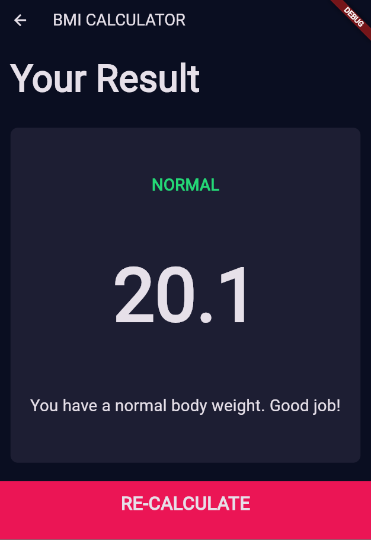

Here’s the cleaned-up `README.md` with all Markdown blocks properly closed and formatted:

````markdown
# BMI Calculator

A simple Flutter app to calculate your Body Mass Index (BMI) and give a quick health interpretation. Built following Angela Yu’s Flutter course structure.

---

## 📝 Features

- Enter height (cm) and weight (kg)  
- Instant BMI calculation  
- Color-coded result display with health category (Underweight, Normal, Overweight, Obese)  
- Reset inputs to start over  

---

## 📱 App Preview

<p float="left">
  
  
</p>

---

## 🛠️ Built With

- [Flutter](https://flutter.dev/)  
- [Dart](https://dart.dev/)  

---

## 🚀 Getting Started

### Prerequisites

- Flutter SDK installed  
- An Android or iOS device/emulator  

### Installation

1. **Clone the repo**  
   ```bash
   git clone https://github.com/RahatalDnyanda/BMI_Calculator.git
   cd BMI_Calculator
````

2. **Install dependencies**

   ```bash
   flutter pub get
   ```

3. **Run the app**

   ```bash
   flutter run
   ```

---

## 📱 Usage

1. Launch the app.
2. Enter your height in centimeters and weight in kilograms.
3. Tap **Calculate** to see your BMI and health category.
4. Tap **Reset** to clear and start again.

---

```
```